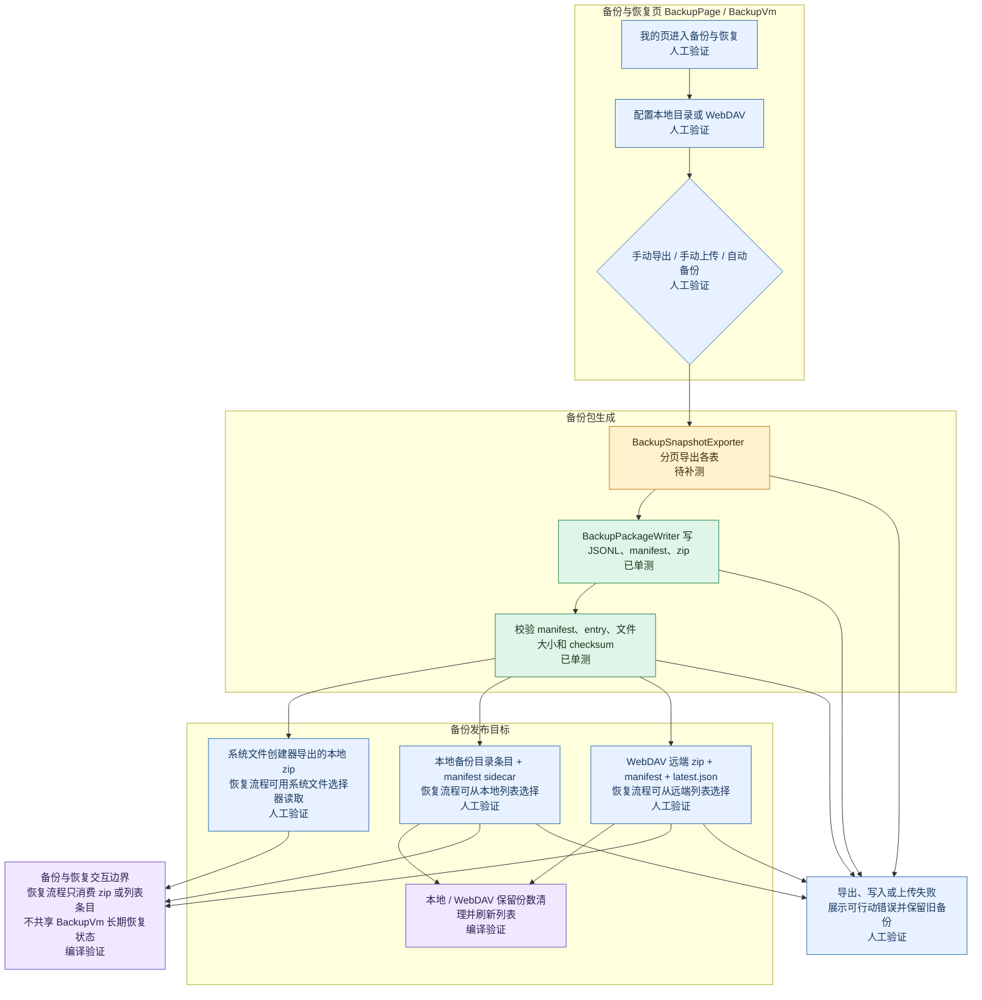
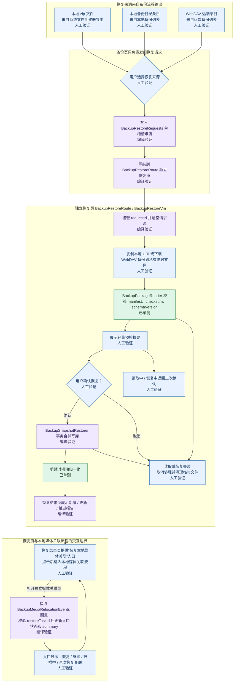
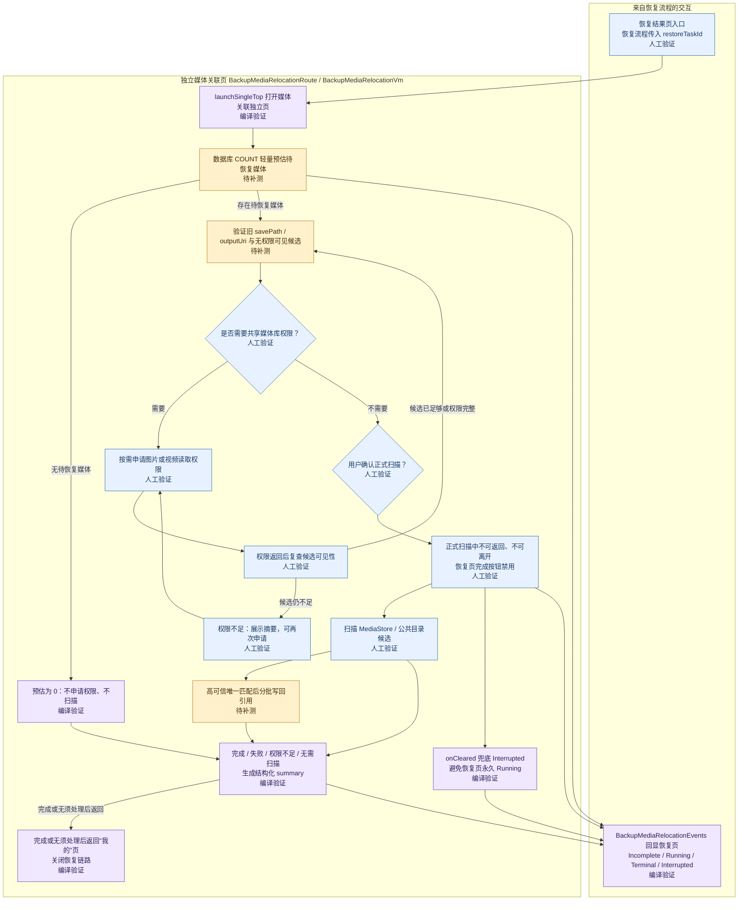

状态：实现中

# WebDAV + 本地自动备份恢复方案

<!-- flow-title: WebDAV本地自动备份恢复流程 -->

## 当前状态

项目当前数据主要存放在 Room 数据库和 MMKV 中：剪贴数据、来源 App、链接预览、搜索历史、视频下载记录、图片下载记录由 base 主库承载；磁力搜索历史和磁力复制/打开记录在启用 `:feature:magnet` 时由磁力模块独立数据库承载；剪贴快捷动作、回收站保留天数等轻量设置由 `AppSetting` 承载。当前已接入统一备份恢复能力，支持本地手动导出/导入预检恢复，以及 WebDAV 手动测试、上传、列表、预览和恢复；新导出使用 `schemaVersion = 4` 的 zip + JSONL 流式协议，schemaVersion 3 曾把磁力 JSONL 作为必需 entry，schemaVersion 2 不包含磁力用户数据但继续兼容导入，旧 v1 JSON 数组 zip 只读兼容导入。

本方案新增统一 `BackupSnapshot` 备份包，同一套导出、预检、恢复和报告逻辑同时服务本地文件备份与 WebDAV 备份。第一版定位是“备份/恢复”，不是多设备实时同步；多个设备可以共用同一 WebDAV 目录并看到彼此备份，但不保证自动双向同步或冲突同步。

恢复剪贴记录时会对 `timestamp`、`pinned_time`、`folded_at`、`deleted_at` 做本机时间轴归一化：如果备份来自时钟偏快的设备，先按 manifest 创建时间和本机恢复时间的正向偏移整体平移，再把仍落在未来的字段限制到恢复开始时间以内；本地较新状态保护也使用归一化后的备份创建时间，避免远端数据长期显示“现在”并压过后续新复制内容。

当前代码组织已将备份包 IO、导出、恢复和 mapper 拆到独立协作者：`BackupPackageWriter` / `BackupPackageReader` 负责 JSONL、zip、manifest 和 checksum，`BackupSnapshotExporter` 负责分页导出、high-water mark、设置白名单读取、可选 `BackupFeatureContributor` 扩展和 manifest 组装，`BackupSnapshotRestorer` 负责 v1/v2/v3/v4 预检后的事务恢复、chunk 写库、幂等报告、本地较新保护和可选功能恢复参与者调用，`BackupEntityMappers` 负责 base Room 实体与备份协议模型转换，`BackupRepository` 聚焦对外 API、互斥和预检委托。整理过程不改变备份 UI 流程，只把可选磁力数据从 base 固定协议拆到磁力模块参与者。

## 目标

- 完成“导出备份 → 卸载重装 → 恢复数据”的可靠闭环。
- 第一版支持本地手动导出/导入、WebDAV 手动备份/恢复、恢复前预检和恢复后报告。
- 当前阶段补齐 WebDAV/本地统一自动备份、dirty 标记、普通备份保留份数、大数据量导出/导入流式化和恢复后的下载媒体重新定位入口；后续阶段再补齐前台通知、首次恢复引导和分类恢复。
- 备份包不加密；当前以 `.zip` 承载 `manifest.json`、设置 JSON 和多个业务 JSONL 文件，用户界面必须提示备份文件包含剪贴内容，应保存到可信位置。

## 范围

第一版备份范围：

- 剪贴数据，包括置顶、折叠、回收站状态和时间戳。
- 来源 App 缓存，包括包名、名称、图标缓存路径、主色和图标哈希。
- 链接预览缓存。
- 搜索历史。
- 启用 `:feature:magnet` 时，磁力搜索历史和磁力复制/打开记录由磁力模块作为可选功能数据参与备份。
- 核心用户偏好，包括剪贴快捷动作和回收站保留天数。
- 下载记录元数据，包括视频下载任务和图片提取/下载批次、图片项。

第一版不备份：

- 视频/图片媒体文件本体。
- Academic Torrents 源索引缓存、XML 临时文件、缓存元数据和本地 FTS 索引。
- WebDAV 密码、本地目录授权 URI、健康状态、失败次数、运行中任务状态。
- 上述健康状态和运行中/最近任务状态仍属于设备绑定运行态，不纳入备份；本次只补充 R8 名称稳定性，不改变备份字段白名单。
- `cookie`、`pendingOutputUri`、`tempPath`、未完成临时文件、可恢复登录态。

## 用户体验

- “我的”页新增“备份与恢复”入口。
- 页面分为本地备份和 WebDAV 备份两块。
- 本地备份支持通过系统文件创建器导出备份文件，通过系统文件选择器导入并预览备份；用户也可以选择一个持久化授权的本地备份文件夹，设置后页面展示用户可识别的本地路径/目录名。备份页不在“设置备份文件夹”旁展示清除按钮，减少误操作和按钮密度；设置文件夹后自动读取一次列表，同时保留显式“刷新列表”按钮和提示文案。
- WebDAV 备份支持配置服务地址、账号、密码、远端目录，默认远端目录为 `/ClipMaster/backups/`，用户可修改。
- WebDAV 测试连接会校验 HTTPS、目录规范化、目录存在性和可写性；测试成功后自动刷新远端备份列表，页面同时保留显式“刷新列表”按钮和提示文案，避免用户误以为列表会自动常驻更新。
- 如果已设置本地备份文件夹，WebDAV 手动备份会使用同一份 zip 快照先写入本地文件夹，再上传 WebDAV；本地写入失败时停止上传，避免用户误以为本地已有备份。
- WebDAV 密码保存到独立加密 MMKV；当前仍处于开发阶段，不兼容也不迁移旧默认 MMKV 中的密码配置。
- 备份生成、写入本地文件、上传 WebDAV、上传后的远端保留清理和列表刷新期间展示不可取消的“正在备份”弹窗，避免用户误以为可以重复点击或离开；WebDAV 手动上传的“上传成功”提示只在远端清理与列表刷新完成后展示，确保提示出现时弹窗即将关闭。
- 恢复链路使用真正的独立导航页面，用户选择本地文件、本地备份目录条目或 WebDAV 条目后进入恢复页读取状态，页面内部在读取、预览、恢复中、恢复完成和恢复失败之间切换，避免 BottomSheet 下滑误关闭。
- 备份页和恢复页不共享 `BackupVm`；备份页只把一次性恢复请求写入备份恢复 feature 内部 `BackupRestoreRequests` 单槽请求流，恢复页由独立 `BackupRestoreVm` 接管读取、下载、预览、恢复和临时文件清理。恢复页接管请求后立即按 `requestId` 清空请求流，关闭页面或 ViewModel 销毁时清理临时文件，避免长期持有 URI、WebDAV 条目或备份页状态。
- 恢复页导航栏标题固定为“恢复备份”，不随读取、预览、恢复结果变化；正文顶部状态行展示当前状态，并按读取、预览、恢复中、成功和失败使用不同图标与颜色，让用户能快速识别当前阶段。
- 读取中和恢复中点击返回需要二次确认；确认退出会取消当前读取/恢复协程并清理临时预览状态。若恢复已经进入数据库事务，事务由底层恢复逻辑完成或回滚。
- 恢复前在恢复流程页内展示轻量预检摘要：打开来源、备份类型、文件名、备份时间、App 版本、schemaVersion、文件大小、设备标识、checksum 结果和各类数据数量。
- 恢复不再自动创建恢复前安全快照；恢复采用合并策略并在 Room 事务中写库，失败会回滚。用户如果担心当前数据，可先手动导出普通备份。
- 恢复后在同一个恢复流程页内展示结果报告：恢复文件名、恢复完成时间、总新增/更新/跳过，以及按类别新增/更新/跳过；跳过是正常结果，不使用警告样式。
- 恢复完成页提供“恢复本地媒体关联”手动入口。入口只负责进入独立媒体关联页面，触发当前数据库里所有成功/部分成功下载媒体的本地引用验证和关联恢复，不限定本次恢复包；恢复完成后不自动跳转、不自动预估，App 重新进入、进程重启或回到恢复页后都不会自动触发或自动续跑该任务。若独立媒体关联页进入成功完成或无须处理终态，用户点击顶部返回或底部“完成”时关闭备份/恢复链路并导航到 `MainRoute(initialTab = Mine)`，直接回到带底部导航的“我的”页；失败、权限不足、预估、权限请求和待确认阶段仍返回恢复页，方便重试或继续处理。
- 恢复完成页同时展示媒体关联的一行简洁摘要和视频/图片详细分类数字；摘要来自恢复页 ViewModel 中保存的结构化 `MediaRelocationSummary`，不保存已格式化文案，UI 通过字符串资源展示。新一轮预估、待确认或扫描中不清空上一轮终态摘要，直到新的终态或异常中断摘要替换。
- 媒体关联由独立 `BackupMediaRelocationRoute(restoreTaskId)` 和 `BackupMediaRelocationVm` 承载；恢复页入口点击做防抖，`BackupMediaRelocationRoute` 作为目标页统一使用 `launchSingleTop` 导航，正式扫描中入口禁用。真正防止旧流程串写由恢复页 ViewModel 收到事件后校验 `restoreTaskId` 完成。
- 媒体关联状态通过 feature 内部不可重放事件流通知恢复页：`BackupMediaRelocationEvents` 只服务备份恢复媒体关联，不作为通用 EventBus；事件包含 `Incomplete(restoreTaskId)`、`Running(restoreTaskId)`、`Terminal(restoreTaskId, summary)` 和 `Interrupted(restoreTaskId, summary)`。事件流 `replay = 0`，只做通知，不保存状态；恢复页 ViewModel 在 `init` 中收集事件，校验 `restoreTaskId` 后落成本地 `mediaRelocationEntryState` 和 `lastTerminalMediaRelocationSummary`。
- 媒体重新定位启动前在独立页面展示轻量预估，统计待恢复关联视频数、图片批次数和成功图片项数，并用“预计几秒 / 可能几十秒 / 可能 1 分钟以上”这类保守区间提示耗时。预估为 0 时直接展示暂无需要恢复关联，不申请权限，也不进入不可退出流程。
- 媒体重新定位按“预估 → 验证旧引用和无权限可见候选 → 按需权限请求 → 用户确认 → 正式扫描”执行；预估、权限请求和用户确认阶段允许返回恢复页，再次进入可重新预估，不承诺复用上一次 `MediaRelocationPreparation`。正式扫描开始后媒体关联页不可中断、不可退出，顶部返回、系统返回和离开入口全部拦截；恢复页底部“完成”按钮禁用。成功完成或无须处理终态表示恢复补充流程已闭环，返回动作不再回到恢复完成页，而是收起 `BackupRoute` / `BackupRestoreRoute` / `BackupMediaRelocationRoute` 链路并落到“我的”页。Android Home 键、进程被杀、系统回收和关机无法阻止，异常中断后不自动续跑，用户可再次手动触发。
- 媒体重新定位完成、无需扫描、失败、权限不足或异常中断后，独立页面展示简洁摘要和详细分类数字，并通过 `Terminal` 或 `Interrupted` 事件回显到恢复页；恢复页入口按钮文案改为“再次恢复关联”。完成和无需扫描属于正向闭环，`BackupMediaRelocationVm` 在发送对应终态 summary 时同步记录“返回应关闭恢复链路”，顶部返回、系统返回和底部“完成”统一进入页面 `requestBack()` 并优先读取该标记，避免 Compose 本地 state 尚未切到 `Result/NoWork` 时落回普通返回，也避免底部按钮绕过同一返回判断；`MediaRelocationUiState` 相关派生属性集中放在状态模型文件，导航收栈细节封装为命名函数；失败、权限不足、异常中断或非终态返回恢复页时，入口文案为“继续恢复关联”或“再次恢复关联”，方便用户重试或继续进入该功能流程，不表示复用上一次准备态。
- 媒体重新定位不会修改下载记录状态，不会重新下载，不会恢复媒体文件本体；它只在高可信唯一匹配时写回新的本地媒体引用。未找到时下载记录仍保持原 success/partial_success 等历史语义，记录页继续展示本地文件不可读并保留重新下载入口。
- 自动备份默认关闭。用户开启时必须至少配置一个备份目标；已设置本地目录则先写本地，WebDAV 配置可用时再上传远端。
- 自动备份页内配置统一开关、普通备份保留份数和仅 Wi-Fi；页面展示最近自动备份状态、最近成功摘要、跳过/失败原因和 WebDAV 健康状态缓存。
- 最近自动备份状态 `BackupTaskStatus` 和 WebDAV 健康状态 `BackupTargetHealth` 只作为本机脱敏状态保存到 MMKV，不进入备份包；因为当前读写仍使用枚举名，枚举本身需要 `@Keep` 保留 release R8 名称契约。
- 本地备份目录和 WebDAV 备份列表只展示普通手动/自动备份；历史版本可能留下的 `safety` 回滚文件会通过 manifest 或文件名识别并隐藏，避免用户误认为它是普通备份。
- 本地镜像和 WebDAV 远端可能出现同名备份文件；备份列表 UI 的稳定 key 必须包含来源和真实路径/URI，不能只使用 `fileName`，避免同一 `LazyColumn` 内 key 冲突。

## 流程图

### 备份流程



### 恢复流程



### 本地媒体关联流程



## 数据流

### 本地导出

1. 用户选择“导出本地备份”。
2. 页面通过系统文件创建器拿到写入 URI。
3. `BackupRepository` 记录各表 high-water mark，并按分页读取当前窗口内的数据。
4. `BackupPackageWriter` 先写入各业务 JSONL 临时文件和设置 JSON，再生成 `BackupManifest`。
5. 生成 `.zip` 备份包，校验包内 `manifest.json`、业务 entry、文件大小和 checksum 后写入用户选择的文件。

### 本地备份文件夹

1. 用户通过系统目录选择器选择本地备份文件夹，应用保存持久化读写授权 URI，并尽量解析目录 displayName 或 URI 尾段作为页面展示路径。
2. 本地备份文件夹 URI 只保存在本机配置，不进入 `BackupSnapshot`，系统 Auto Backup 也需要排除。
3. 后续 WebDAV 手动备份或自动备份复用该目录时，必须用同一份 `BackupExportResult` 写入 `.zip` 文件和 manifest sidecar，确保本地与远端备份内容一致。
4. 本地目录授权失效、目录不可写或文件创建失败时，返回可行动错误并停止后续 WebDAV 上传。

### 本地导入

1. 用户通过系统文件选择器选择备份文件。
2. `BackupRepository` 通过私有临时文件和 `ZipFile` 校验格式标识、`applicationId`、schemaVersion、包内文件清单和 checksum。
3. 页面展示预检摘要，只预览不写库。
4. 用户确认后，Repository 按 JSONL 行和 chunk 解析数据；剪贴记录写库前先归一化未来时间字段，再在事务中合并恢复。
5. 恢复完成后展示恢复报告。

### WebDAV 手动备份

1. 用户填写 WebDAV 配置并测试连接。
2. 测试连接规范化远端目录；目录不存在时尝试创建，存在时检查可写。
3. 手动备份生成时间戳 `.zip` 文件和 manifest sidecar。
4. 如果已设置本地备份文件夹，先把同一份 `.zip` 快照和 manifest sidecar 写入本地文件夹；本地写入成功后才继续 WebDAV 上传。
5. 两阶段提交：先上传临时 `.zip` 快照和临时 manifest，下载临时快照校验后发布正式文件，并用 manifest 更新 `latest.json`。
6. 备份成功后按创建时间清理旧远端普通备份并刷新列表；手动上传成功提示在清理和列表刷新完成后展示，避免先提示成功但长任务弹窗仍停留。

### 自动备份

1. 应用启动、用户修改备份配置或 dirty 状态变化后，由 `BackupAutoScheduler` 重新调度 WorkManager 唯一任务。
2. 自动备份使用统一开关。开启时若本地备份目录和 WebDAV 配置都不可用，则提示用户先配置至少一个目标，不静默开启。
3. 周期任务每天兜底执行一次；剪贴数据、回收站状态、搜索历史、核心设置、下载记录元数据等变更后标记 dirty，并延迟 5-10 分钟入队一次性任务。
4. dirty 为 false 时记录为跳过，不按失败展示；恢复期间自动备份暂停，恢复完成后重新标记 dirty 并延迟生成新的稳定备份。
5. 自动备份不弹窗打扰用户，只更新状态；如果系统要求前台服务或任务长时间运行，后续再接入前台通知。
6. 若设置了本地目录，先写入 `.zip` 和 manifest；若 WebDAV 配置可用，再上传同一份快照到远端。本地成功但 WebDAV 失败时记录部分成功，不覆盖本地成功结果。

### 保留份数

1. 普通备份默认保留 5 份，用户可设置 1-20；本地和 WebDAV 都按该数量保留最近的普通备份。
2. 手动备份和自动备份都算普通备份，统一参与保留清理，不再区分当前安装标识或旧安装标识。
3. 清理不删除旧版 safety 回滚文件、manifest 损坏文件、不可识别文件或用户目录里的其他文件，避免异常文件被误删。
4. 新备份完整写入、校验和发布成功后才清理旧备份，避免新备份失败时旧备份也被删除；手动刷新列表也会触发一次保留清理，让历史超额备份立即收敛。
5. 排序优先使用 manifest `created_at`，缺失时使用文件名时间戳或服务端修改时间兜底。
6. `latest.json` 不计入保留份数。
7. 每次备份或刷新清理后记录本地/WebDAV 清理了多少旧备份，最近成功摘要中展示自动备份产生的清理结果。

### 恢复安全边界

1. 恢复前只做预检，不再自动生成 `backupKind = safety` 的恢复前安全快照。
2. 恢复写库阶段保持 Room transaction，失败会回滚，不留下半恢复状态。
3. 恢复确认文案提示用户：恢复会合并到当前数据，不会清空；如需保留恢复前状态，请先手动导出普通备份。
4. 历史版本已经生成的 `backupKind = safety` 文件不会被新流程自动删除，但备份列表会隐藏这些旧回滚文件，避免干扰普通备份选择。

### WebDAV 手动恢复

1. 列举远端目录中的 `.zip` 快照并读取对应 manifest sidecar，列表只读 manifest，不为展示摘要下载完整备份。
2. `latest.json` 只作为最近备份 manifest 指针；损坏时回退扫描时间戳 `.zip` 快照，选择最新可校验文件。
3. 用户预览指定备份时下载完整 `.zip` 快照并执行同本地导入的预检流程。
4. 用户确认后执行合并恢复。

### 恢复后的媒体重新定位

1. 恢复结果页的“恢复本地媒体关联”只作为手动入口；点击后进入 `BackupMediaRelocationRoute(restoreTaskId)`，实际扫描当前数据库内所有成功视频记录、成功/部分成功图片批次和成功图片项，不限定本次恢复包。
2. 媒体关联页使用独立 `BackupMediaRelocationVm` 承载预估、权限、确认、扫描、进度和写回；`BackupRestoreVm` 只维护恢复页回显状态，不直接执行媒体扫描。备份恢复请求中转由 feature 内部 `BackupRestoreRequests` 承担，媒体关联回显继续由 `BackupMediaRelocationEvents` 承担，两者都不作为通用 EventBus。
3. `BackupMediaRelocationEvents` 是 feature 内部不可重放事件流，只暴露只读 `SharedFlow` 和具名发送方法，不做通用 EventBus。正常路径发送事件使用 `emit`，`onCleared()` 兜底只能使用 `tryEmit`，失败时记录低敏日志。
4. 恢复页 ViewModel 在 `init` 中收集 `Incomplete`、`Running`、`Terminal` 和 `Interrupted` 事件，并先校验 `restoreTaskId`；不匹配事件直接忽略。事件流只做通知，恢复页必须把当前事实落到本地 `mediaRelocationEntryState` 和 `lastTerminalMediaRelocationSummary`。
5. `mediaRelocationEntryState` 只表达入口状态：`NotStarted` 显示“恢复本地媒体关联”，`Incomplete` 显示“继续恢复关联”，`Running` 禁用入口并显示扫描中，`Terminal` 显示“再次恢复关联”。`lastTerminalMediaRelocationSummary` 保存结构化结果，用于恢复页一行简洁摘要和视频/图片详细分类数字；新一轮 `Incomplete` 或 `Running` 不清空上一轮结果。
6. 首次进入媒体关联页时执行一次预估；重组、屏幕方向切换或权限页返回不重复触发。入口双击通过按钮防抖和 `launchSingleTop` 避免重复打开页面；`BackupMediaRelocationVm` 仍需要用当前 job 或状态门禁保证 `estimate()`、权限回调和 `startScan()` 幂等。
7. 第一阶段只做数据库 COUNT 和轻量分组统计，生成待恢复关联视频数、图片批次数、图片项数和保守耗时区间；这一阶段不访问 MediaStore。进入非终态流程时发送 `Incomplete`，但不发送或清空终态 summary。
8. 用户确认前先验证既有媒体引用：视频验证 `savePath`，图片验证 `outputUri`；旧引用仍可读时计入 `existing_readable`，不扫描、不申请权限、不写回。Android 10+ 在缺少媒体读取权限时，还会先尝试查询当前应用仍可见的 MediaStore 候选；如果候选已经足够唯一定位，也不申请权限。
9. 只有存在不可读旧引用、无权限可见候选仍不足以定位，且继续扫描共享媒体库确实需要系统授权时才按需申请权限：只有图片需要授权时只申请图片媒体权限，只有视频需要授权时只申请视频媒体权限；Android 14+ 用户选择“部分照片/视频”只授予有限媒体集合，不能支持按目录批量扫描，权限回调后先展示“正在确认媒体权限”的过渡态并重新探测候选可见性，仍不足时继续停留在权限请求态并展示权限不足摘要，用户可直接再次申请，不需要重新预估。第一版不申请全文件访问权限。
10. 预估、权限请求和用户确认阶段允许返回恢复页；如果媒体关联页 ViewModel 已销毁，再次进入可重新预估，不跨页面保存 `MediaRelocationPreparation`。权限页返回后仍停留在媒体关联页并继续展示当前状态。完成或无须处理终态点击顶部返回或底部“完成”时，应直接回到首页“我的”Tab，不再回到已经完成的恢复页。
11. 正式扫描由 app 层 `DownloadedMediaRelocator` 承接，因为它依赖 `Context`、运行时权限、MediaStore 和旧系统公共路径；`BackupSnapshotRestorer` 继续只负责备份数据入库。正式扫描开始时发送 `Running`，顶部返回、系统返回和离开入口全部拦截；恢复页底部“完成”按钮禁用，避免用户误以为可以离开。
12. 视频只在应用保存目录 `DCIM/clipMaster` 中查找，候选文件名限定为 `fileName.mp4` 或 `fileName_N.mp4`；有可用大小信息时必须匹配，候选唯一且可信时写回 `savePath` 并清空 `pendingOutputUri`。
13. 图片以批次为单位处理并按批次展示进度；先规范化 `outputDir` 得到目标文件夹。Android 10+ 先查 MediaStore `RELATIVE_PATH` 是否存在未回收站可见图片；Android 9 及以下先查 `Pictures/clipMaster/<folderName>`，必要时兼容 `DCIM/clipMaster/<folderName>`。
14. 图片批次文件夹不存在或目录下没有可见媒体时，整批成功图片项直接判定未定位，不再按 `finalName` 全局搜索；文件夹存在时只在该文件夹内按 `finalName` 匹配，宽高可用时必须一致，Android 11+ 排除 `IS_TRASHED`。
15. 图片项缺少 `finalName` 时直接跳过，不用 URL、顺序号、页面标题或模糊相似度猜测文件名，避免误绑用户相册里的同名旧文件。
16. 写回按 100 条一组的小事务执行；单个 chunk 失败只影响当前 chunk。完成报告按视频和图片分开展示已可用、已恢复关联、未定位、整批失效、多候选、权限不足和写回失败数量，并先映射为结构化 `MediaRelocationSummary`，再由 UI formatter 本地化展示。
17. 完成、无需扫描、失败或权限不足后展示简洁摘要和详细分类数字，并发送 `Terminal(restoreTaskId, summary)`。`BackupMediaRelocationVm.onCleared()` 若发现仍处于 `Running`，发送 `Interrupted(restoreTaskId, summary)` 兜底，恢复页收敛为可重试/中断摘要，避免“完成”按钮永久禁用。
18. 第一版不清理旧失效 URI/路径，只有高可信定位到新引用时才覆盖旧 hint；成功写回任何媒体引用后标记自动备份 dirty，让后续备份包含新的可用 hint。
19. `outputDir`、`finalName` 和 `savePath` 只是定位线索，不承诺跨设备一定找回媒体；如果媒体文件本体没有同步到当前设备，相同目录或文件名也只会作为候选，不会被当成已恢复。

## 备份格式

当前 v1 备份文件是单个 `.zip` 包，对系统文件选择器和 WebDAV 来说仍是一个文件，但包内已经文件化，避免把所有数据放进一条巨大 JSON。包内结构固定如下：

- `manifest.json`：格式标识、schemaVersion、应用版本、创建时间、总摘要、每个业务数据文件的大小和 checksum。
- `data/settings.json`：跨安装有意义的用户偏好。
- `data/clips.json`、`data/source_apps.json`、`data/link_previews.json`、`data/search_histories.json`：核心剪贴与检索数据。
- `data/video_downloads.json`、`data/image_batches.json`、`data/image_items.json`：下载记录元数据。
- `schemaVersion = 4` 起 base 必需 JSONL entry 不再包含磁力文件；启用 `:feature:magnet` 时，磁力模块通过可选 `BackupFeatureContributor` 追加 `data/magnet_search_histories.jsonl` 和 `data/magnet_download_records.jsonl`。`schemaVersion = 3` 历史协议曾把这两个磁力 JSONL 作为必需 entry，继续兼容校验和恢复。

当前 base 新导出实际使用 JSONL 文件名：`data/clips.jsonl`、`data/source_apps.jsonl`、`data/link_previews.jsonl`、`data/search_histories.jsonl`、`data/video_downloads.jsonl`、`data/image_batches.jsonl` 和 `data/image_items.jsonl`；磁力模块启用时额外写入 `data/magnet_search_histories.jsonl` 和 `data/magnet_download_records.jsonl`；v1 JSON 数组文件名仅用于旧包兼容导入。

manifest 简化示例：

```json
{
  "format": "clip_master_backup",
  "application_id": "com.cla.clip.master",
  "schema_version": 4,
  "encryption": "none",
  "compression": "zip",
  "created_at": 1716000000000,
  "app_version_code": 19,
  "app_version_name": "0.3.2",
  "device_label": "install-ab12cd34",
  "source": "local_manual",
  "backup_kind": "manual",
  "snapshot_file_name": "clip_master_backup_install-ab12cd34_20260519_120000.zip",
  "file_size": 4096,
  "checksum": "sha256-hex",
  "files": [
    {
      "path": "data/clips.json",
      "size": 1234,
      "checksum": "sha256-hex"
    }
  ],
  "summary": {
    "clip_count": 10,
    "source_app_count": 3,
    "link_preview_count": 2,
    "search_history_count": 5,
    "video_download_count": 1,
    "image_batch_count": 1,
    "image_item_count": 8,
    "feature_counts": {
      "magnet_search_history_count": 1,
      "magnet_download_record_count": 1
    }
  }
}
```

`checksum` 对包内各业务数据文件的路径、大小和文件 SHA-256 生成汇总 SHA-256，用来发现半截文件、业务文件缺失或服务端异常改写。恢复时必须先校验 manifest、逐文件 checksum 和 App 身份，再按事务分批恢复，避免半包数据写入本地。后续可继续扩展媒体目录、流式 JSON、gzip 压缩和备份包加密，但不能回退成单条 JSON 保存所有业务数据。

## 恢复规则

- 恢复时不清空本地数据，采用合并去重；同一个备份重复恢复多次结果稳定。
- 同一条剪贴记录按内容、来源包名和时间状态构造稳定去重 key；字段冲突默认按更新时间较新者优先。
- 来源 App 按包名幂等恢复；链接预览按链接 URL 幂等恢复；搜索历史按“搜索范围 + 规范化关键词”幂等恢复。恢复报告必须按真实新增、更新、跳过统计，不能把 `upsert` 写入条数直接当成新增数量。
- 图片项按 id 恢复，但报告必须先比较备份白名单元数据；只有状态、尺寸、顺序、输出位置、最终文件名或错误信息等元数据确实变化时才计入更新，重复恢复相同备份应计入跳过。
- 本地在备份创建时间之后产生的新状态不被旧备份覆盖；若备份 manifest 创建时间来自未来设备，则先归一到本机恢复开始时间再参与比较。
- 恢复剪贴数据时保留备份内时间的相对顺序，但会把远端未来时间归一到本机时间轴，避免 `timestamp` 或置顶/折叠/删除时间一直显示“现在”并影响列表排序。
- 回收站剪贴数据继续备份，恢复后仍在回收站。
- 彻底删除的剪贴数据、已删除的下载记录不会进入新的备份；恢复旧备份可能带回旧数据。
- 下载中/合并中的旧下载记录恢复后不恢复后台任务，统一转为已中断或失败状态。
- 恢复剪贴数据时重新计算 `searchText` 等派生字段，不盲信旧备份中的派生值。
- 启用磁力模块时，恢复磁力搜索历史按规范化关键词去重；恢复磁力记录只接受 provider 白名单里的 `academic_torrents` 和合法 40 位 BTIH infoHash。若同一 `sourceId + infoHash` 本地和备份都存在，`firstUsedAt` 取更早值，`lastUsedAt` 更新者胜出，`lastSourceQuery` 跟随更新者；缺失或异常 magnet URI 会按 infoHash 和标题重建，仍无法重建则跳过并计入恢复报告。默认禁用磁力模块时，备份 UI 不展示磁力统计和恢复分类，也不会恢复磁力 entry。
- checksum、格式标识或 `applicationId` 校验失败时禁止导入。

## 安全与隐私

- 备份包第一版不加密，用户可见界面必须提示备份包含剪贴内容。
- 日志和 UI 不输出剪贴内容、账号、密码、Cookie 或完整 URL 查询参数。
- WebDAV 密码只保存在本机独立加密 MMKV 中，不进入备份包；后续如接入 Android Keystore，必须同步验证系统恢复后旧密文不可解时的提示和清理策略。
- 系统 Auto Backup 需要排除 WebDAV 密码、备份目录 URI、健康状态等敏感或设备绑定配置。
- 文件名使用脱敏短标识，例如 `clip_master_backup_<installId8>_<yyyyMMdd_HHmmss>.zip`；真实设备名只放备份元信息，不直接暴露在文件名中。

## 日志与诊断计划

- 自动备份、手动本地备份、手动 WebDAV 备份、恢复、保留清理和 WebDAV 健康检查都生成短 `taskId`，同一次流程的开始、关键阶段、成功、失败、跳过和重试日志必须带同一个 `taskId`。
- 备份相关日志正文、阶段描述、错误说明和人工可读提示必须统一使用简体中文；`taskId`、`reasonCode`、`backupKind`、`target`、字段名、TAG、枚举稳定值等结构化标识保留英文，便于搜索和聚合。
- 启用磁力模块时，磁力搜索历史和磁力记录备份/恢复日志只允许记录数量、provider、合法性跳过数量和 reasonCode；禁止记录完整搜索词、完整标题、完整 magnet URI、完整 infoHash、Academic Torrents XML 内容或完整 URL。
- 自动备份调度记录周期任务更新、dirty 标记、dirty 任务入队/跳过、立即入队和取消，字段只包含自动备份开关、dirty 延迟、网络约束和是否需要网络，不记录 WebDAV 地址或本地授权 URI。
- 自动备份执行记录开始、跳过、快照生成、本地写入开始/成功/失败、WebDAV 上传开始/成功/失败、结束、重试已安排和失败；字段包括目标是否配置、保留份数、备份类型、文件名、文件大小、条目数量、清理数量、耗时和 reasonCode。
- 手动本地备份记录开始、快照生成和成功；手动 WebDAV 备份记录开始、本地镜像写入、WebDAV 上传和成功；字段包括文件名、文件大小、条目数量、耗时和目标状态，不记录用户选择文件 URI、WebDAV endpoint、用户名或密码。
- 恢复流程记录 `restore start/success/failed`，字段包括备份类型、文件大小、预检数量摘要、新增/更新/跳过数量、未来时间归一化字段数、正向时钟偏移毫秒数和耗时；失败日志输出 reasonCode 和异常类型，不输出备份内容。
- 备份恢复流程页状态切换记录 `restore_flow_state_change`，字段包括 `taskId`、`fromState`、`toState`、`sourceType` 和 `reasonCode`；feature 内部恢复请求流只记录 `requestId`、请求类型和消费/清理时机，不记录本地 URI、WebDAV 地址或远端路径；读取/恢复中二次确认退出记录 `flow_closed` 或用户确认退出日志；不记录剪贴内容、搜索词、完整 URL 或备份包内容。
- 媒体重新定位准备阶段记录低敏诊断摘要：API level、缺失图片/视频权限布尔值、旧引用不可读视频数、不可读图片批次数和图片项数、无权限可见唯一候选数、需要授权后继续扫描的数量、缺少搜索线索数量和多候选/元数据不符等授权不可恢复数量；Android 14+ 权限回调后重新执行同一准备探测，用于识别部分媒体访问不足；不输出 URI、路径、文件名、目录名、页面标题或 URL。
- 媒体关联独立页和恢复页之间的 feature 事件流只记录低敏状态转换：`restoreTaskId`、事件类型、是否匹配当前恢复任务、summary 类型、数量摘要和 reasonCode；不输出文件名、路径、URI、目录名、页面标题或 URL。正常事件发送失败不应静默吞掉；`onCleared()` 中 `tryEmit(Interrupted)` 失败时记录 `reasonCode=event_emit_failed` 和当前入口状态，便于排查恢复页“完成”按钮异常禁用。
- 媒体关联页导航防抖、`launchSingleTop` 命中、返回请求时的低敏 UI state/关闭链路标记、成功终态返回“我的”页、`restoreTaskId` 不匹配忽略事件和 Running 状态拦截返回都按 `logD`/`logW` 输出结构化低敏日志；返回请求日志的关键字段先在普通代码路径计算，再交给 `logD` 惰性输出，避免日志开关关闭时影响断点判断。高频进度继续沿用既有节流策略，只记录阶段、已处理数量和耗时，不按单个媒体项输出日志。
- 导出职责拆分后，`BackupSnapshotExporter` 继续复用既有 high-water mark、分页兜底和快照生成日志；本轮不新增新的敏感字段，也不记录单条业务 JSONL 内容。
- 恢复职责拆分后，`BackupSnapshotRestorer` 继续复用既有恢复写库完成日志和解析失败日志；本轮不新增新的敏感字段，也不记录单条恢复内容。
- 本地和 WebDAV 保留清理记录候选数量、待删除数量、成功删除数量、备份类型、保留份数和删除失败 reasonCode；只记录本 App 生成的备份文件名，不记录目录 URI 或 WebDAV URL。
- WebDAV 健康检查和上传记录远端目录长度、是否允许 HTTP、是否存在用户名、状态码、请求阶段和 reasonCode；不输出 endpoint、Authorization、账号、密码、请求体、响应体或完整 header。
- WebDAV 目录存在性检查只在 404 时进入创建分支；IO/TLS 异常统一映射为 `remote_failed` 并记录请求阶段和异常类型，避免误导为目录不存在或不可写。
- `logD` 用于阶段性流程、调度和数量摘要；`logI` 用于用户触发或后台关键任务成功；`logW` 用于跳过、部分成功、可恢复重试或 WebDAV 健康不可用；`logE` 用于任务失败、恢复被阻止或清理删除失败。
- 验证时需要检查 `git diff` 中新增日志是否只包含结构化低敏字段，确认未出现剪贴内容、搜索词全文、完整 URL、WebDAV 密码、本地授权 URI、Cookie、Token、请求/响应全文和备份包内容。

## 实现步骤

### v1 必须完成

- 新增 `BackupSnapshot`、`BackupManifest`、预检摘要和恢复报告模型。
- 备份文件使用 `.zip` 包格式，包内以 `manifest.json` 管理多个业务 JSON 文件和逐文件 checksum。
- 新增 DAO 导出接口和恢复合并接口。
- 新增 `BackupRepository`，支持生成备份、解析备份、预检、恢复和 checksum 校验。
- 新增本地导出/导入 UI。
- 新增本地备份文件夹选择/清除，并在 WebDAV 手动备份前优先写入本地目录。
- 备份和恢复长任务都使用不可取消弹窗提示当前状态，并保持紧凑进度指示。
- 新增 WebDAV 配置、测试连接、手动上传、列举、预览和恢复。
- 新增 `backupKind = manual / auto / safety`，其中 `safety` 仅用于兼容识别旧版恢复前回滚文件；新流程只生成 `manual` 和 `auto`。
- 新增自动备份统一开关、保留份数 1-20、仅 Wi-Fi、dirty 状态、最近自动备份状态和最近成功摘要。
- 新增 WorkManager 自动备份任务：每日兜底、dirty 延迟触发、任务互斥、失败退避、跳过/失败状态区分。
- 新增本地和 WebDAV 普通备份保留清理；手动和自动普通备份都纳入最近 N 份限制，旧版 safety 和异常文件不删除。
- 新增本地备份目录列表，展示普通手动/自动备份并支持预览；旧版 safety 回滚文件只识别隐藏，不作为普通备份展示。
- 更新 `AGENTS.md` 的备份覆盖维护规则。
- 编译验证 `./gradlew :base:general:compileDebugKotlin` 和 `./gradlew :app:compileDebugKotlin`。

### 当前阶段：大数据量备份导出/导入流式化

- 对外仍保持单个 `.zip` 备份文件和 manifest sidecar，不改成本地目录包，不备份媒体文件本体。
- 新导出使用 `schemaVersion = 2` 和 JSONL 数据文件；旧 `schemaVersion = 1` 的 JSON 数组 zip 只读兼容导入，不再新生成。
- 磁力用户数据模块化后，新导出升级为 `schemaVersion = 4`；base 必需 JSONL entry 不再包含磁力文件，磁力模块启用时通过 `BackupFeatureContributor` 追加可选 entry 和 `feature_counts`。旧 `schemaVersion = 3` 磁力 JSONL 作为必需 entry 的备份仍兼容校验和恢复。
- 导出不再生成整包 `ByteArray`：先分页写 JSONL 临时文件并计算 size/checksum，再生成 manifest，最后组装 zip。
- 导出开始时记录可分页表的 high-water mark，本次只导出已存在记录；导出期间新增变化继续保留 dirty，由下一次自动备份补齐。
- 导出流程由 `BackupSnapshotExporter` 承载，仓库入口只负责互斥和对外 API；新增备份表时优先扩展 exporter 的分页导出方法、`BackupSummaryBuilder` 和 mapper，不把导出细节继续塞回 `BackupRepository`。
- 恢复流程由 `BackupSnapshotRestorer` 承载，仓库入口只负责互斥和对外 API；新增备份表时优先扩展 restorer 的 v1/v2 分支、chunk 合并规则、分类报告和 mapper，不把恢复事务继续塞回 `BackupRepository`。
- Room 实体与备份协议模型转换集中在 `BackupEntityMappers.kt`；这些 mapper 只处理字段白名单、派生字段重建、敏感字段剔除和运行中任务降级，不直接读取数据库、文件或网络。
- 预览和恢复改为 `BackupPackageRef` 文件引用；外部 URI 和 WebDAV 下载先复制到应用私有临时文件，再用 `ZipFile` 读取 manifest、entry 和 checksum。
- 预览只解析 manifest 和流式校验完整性，不反序列化全部业务数据。
- 恢复按 JSONL 行和 chunk 解析、查询已有记录并写库；进入 Room transaction 后不可取消。
- 本地 SAF 和 WebDAV 写入都改为文件流复制；WebDAV 上传使用带 `Content-Length` 的文件 RequestBody，发布正式文件前重新校验远端临时 zip。
- 临时文件按导出和导入下载分区保存，文件名带 taskId；启动或进入备份页时清理过期临时文件，保留清理忽略 `.tmp`。
- 备份/恢复弹窗从单一文案升级为阶段 + 数量；日志按阶段和类别节流记录，不按 JSONL 每行输出。
- v2 只优化元数据备份，不包含视频/图片文件本体；媒体重新定位只绑定已有本地媒体引用，不改变备份包内容。

### 当前阶段：恢复本地媒体关联独立页落地

- 新增 `BackupMediaRelocationRoute(restoreTaskId)`、`BackupMediaRelocationPage` 和 `BackupMediaRelocationVm`，恢复页只负责手动入口、`launchSingleTop` 导航和终态摘要回显，不再直接执行媒体扫描。
- 新增 feature 内部 `BackupMediaRelocationEvents`，以 `Incomplete`、`Running`、`Terminal` 和 `Interrupted` 四类不可重放事件连接媒体关联页与恢复页；恢复页按 `restoreTaskId` 过滤旧事件，并把匹配事件落到 `mediaRelocationEntryState` 和 `lastTerminalMediaRelocationSummary`。
- 新增结构化 `MediaRelocationSummary`，恢复页和独立媒体关联页共用同一组 summary/result formatter，通过字符串资源生成一行摘要和视频/图片明细，不保存已格式化文案。
- 独立媒体关联页复用既有 `DownloadedMediaRelocator`、`MediaRelocationEstimate`、`MediaRelocationPreparation`、`MediaRelocationProgress` 和 `MediaRelocationReport`，不改备份包协议、不新增 Room schema，也不改变下载记录状态。
- 恢复页入口增加 600ms 防抖，`BackupMediaRelocationRoute` 在统一 `onNavigate` 策略中使用 `launchSingleTop`；正式扫描开始后拦截顶部返回和系统返回，恢复页“完成”按钮按 `Running` 入口状态禁用；媒体关联完成或无须处理后返回会收起恢复链路并进入 `MainRoute(initialTab = Mine)`。
- 日志沿用既有媒体重新定位准备/进度低敏日志，新增事件发送/接收、导航防抖和 Running 返回拦截日志；只输出 `restoreTaskId`、事件类型、summary 类型、数量和 reasonCode，不输出 URI、路径、目录名或文件名。

### 后续增强

- 首次恢复引导。
- 前台通知和长任务取消边界。
- 分类恢复。
- gzip 压缩和加密备份。
- 媒体文件化备份目录：只在明确启用媒体备份后保存媒体文件本体。
- golden 备份测试文件。

## 测试验证

- 本地导出后从文件预检，确认摘要正确。
- 同一个备份重复恢复不会产生重复数据。
- App 身份不匹配、schemaVersion 不支持、checksum 损坏、半截 zip 或缺失业务数据文件均禁止导入。
- WebDAV 默认目录可用，用户修改目录后能保存并规范化。
- 设置本地备份文件夹后，WebDAV 手动备份会先在本地目录生成 `.zip` 和 manifest，再上传 WebDAV。
- 设置本地备份文件夹后，页面展示已设置的目录路径或目录名。
- 本地备份文件夹授权失效时，WebDAV 手动备份停止上传并提示目录不可写。
- WebDAV 目录存在时不应触发创建；只有服务端明确返回 404 时才逐级创建目录。TLS、证书、网络、认证、跳转失败或服务端错误不能被误判为“目录不存在”，应直接按远端失败或认证失败提示。
- WebDAV `latest.json` 损坏时可以回退扫描快照。
- 大量剪贴数据备份时不明显卡死或 OOM。
- 从远端或本地恢复来自未来时间轴的备份后，剪贴卡片不再长期显示“现在”；恢复后新复制的普通数据应排在置顶数据下方、旧恢复普通数据上方。
- 恢复完成后不会自动进入媒体关联页；用户点击“恢复本地媒体关联”后导航到独立页面并先展示预估。入口需要防抖并使用 `launchSingleTop`，Running 状态下入口禁用，避免重复打开多个媒体关联页。媒体关联完成或无须处理后，顶部返回和底部“完成”都应直接回到“我的”页。
- `restoreTaskId` 不匹配的媒体关联事件必须被恢复页 ViewModel 忽略；匹配事件能驱动 `Incomplete`、`Running`、`Terminal` 和 `Interrupted` 回显状态。新一轮 `Incomplete` 或 `Running` 不应清空上一轮终态摘要。
- 预估为 0 时不申请权限、不进入扫描。Android 10+ 旧 URI 不可读时，会先尝试无权限查询当前应用可见媒体，只有仍需要共享媒体库可见性时才请求图片或视频读取权限。
- 预估、权限请求和用户确认阶段允许返回恢复页；再次进入媒体关联页可以重新预估。正式扫描开始后媒体关联页顶部返回、系统返回和离开入口都不退出、不取消；恢复页“完成”按钮禁用。完成或无须处理终态再返回时，不回到恢复页，而是进入带底部导航的“我的”页。
- 媒体重新定位完成、无需扫描、失败、权限不足或异常中断后，独立页面和恢复页都显示同一个结构化 summary 派生的一行摘要和视频/图片详细分类数字；操作按钮显示“再次恢复关联”，用户能区分当前已经有恢复关联结果。
- 旧 `savePath` 或 `outputUri` 仍可读时只计入已可用，不扫描、不写回；重复触发结果幂等。
- 图片批次文件夹不存在或目录下无可见媒体时，整批成功图片项判定未定位，不做全局同名搜索；缺少 `finalName` 的图片项直接跳过。
- 写回 chunk 失败只影响当前 100 条，报告准确区分成功、跳过、失败和权限不足。
- 双击开始恢复关联、重复权限回调、重组、屏幕方向切换或权限页返回不能启动多个预估或扫描任务；`BackupMediaRelocationVm` 的状态门禁是最终防线。
- 扫描成功、失败、异常中断或 `BackupMediaRelocationVm` 清理后都不能让恢复页永久停留在 `Running`；`Interrupted` 兜底摘要应解除“完成”按钮禁用并允许用户再次进入媒体关联流程。成功或无须处理终态的返回操作还需要验证恢复页不会重新出现在返回栈顶。
- 亮/暗色、横屏、小屏和动态字体下，媒体关联独立页正文可滚动、底部操作区固定，关键按钮和结果数字可读可操作。
- release/R8 构建下最近自动备份状态和 WebDAV 健康状态应能从 MMKV 中按原枚举名恢复，不因枚举混淆回退为默认状态。

## 已知取舍

- 第一版不备份媒体文件本体，只恢复下载记录元数据。
- 第一版不做多设备同步，只做备份快照和手动恢复。
- 第一版不做备份包加密，隐私依赖用户选择可信存储位置与 WebDAV HTTPS。
- 新导出已经升级为 `.zip` + JSONL 文件化流式管线；旧 v1 JSON 数组 zip 仅用于兼容导入，仍可能走局部字节读取，因此大文件性能基准主要以 v2 备份为准。
- 第一版 WebDAV 密码已保存到独立加密 MMKV，但该方案不等同于用户可跨安装恢复的端到端加密；后续需要评估 Keystore、用户恢复密码和系统 Auto Backup 的兼容边界。
- 自动备份第一版使用统一开关，不拆分本地/WebDAV 独立开关；本地目录和 WebDAV 配置作为目标可用性共同决定执行范围。
- 保留清理默认清理本地/WebDAV 目标内所有可识别的普通备份，手动和自动、当前安装和旧安装都纳入最近 N 份限制，换取更简单直观的用户模型。
- 恢复前安全快照已移除；如用户需要恢复前回滚点，应手动导出普通备份，降低自动生成空回滚文件导致误解的风险。
- 未来时间归一化只修正剪贴记录的用户可见时间轴字段，不调整搜索历史、下载记录和图片记录时间；这些数据不参与剪贴列表排序，且下载/图片记录的状态时间可能用于任务诊断，默认保留备份原值。
- 本轮已将恢复事务、chunk 写库、幂等报告和本地较新保护收敛到 `BackupSnapshotRestorer`；暂不再细分到每张表独立 restorer，原因是 v1/v2 分类报告、设置恢复和 Room transaction 仍需要统一编排，过早拆成多类会增加事务边界和报告聚合的维护成本。
- 媒体重新定位第一版不新增 schema 状态字段，不把“未定位”写成下载失败状态；记录页继续用现有本地文件可读性校验展示不可读状态。
- 媒体重新定位结果只保存在当前恢复流程的恢复页 ViewModel 回显状态中，不持久化为后台待继续任务；feature 事件流 `replay = 0` 且不保存事实状态，重新进入 App 后必须由用户再次手动触发。

## 开放问题

- 自动备份执行时是否需要前台通知由阶段 4 统一评估。
- 备份包加密是否作为默认能力，需要在用户愿意管理恢复密码后再开启。

## 验证记录

- 2026-05-24：已运行 `python -m unittest tools.test_render_doc_flow_html`，结果通过；确认方案文档 HTML 流程图生成脚本的 Mermaid 提取、中文命名、离线资源检查和漂移检测可用。
- 2026-05-24：已运行 `python tools/render_doc_flow_html.py docs/webdav_backup_plan.md` 与 `python tools/render_doc_flow_html.py --check docs/webdav_backup_plan.md`，结果通过；确认 `docs/flows/WebDAV本地自动备份恢复流程.html` 已生成并与本方案 Markdown 同步。
- 2026-05-24：根据流程图细节反馈，已运行 `python tools/render_doc_flow_html.py docs/webdav_backup_plan.md` 与 `python tools/render_doc_flow_html.py --check docs/webdav_backup_plan.md`，结果通过；确认细化后的页面边界流程图已重新生成并与本方案 Markdown 同步。
- 2026-05-24：根据流程图可读性反馈，已运行 `python -m unittest tools.test_render_doc_flow_html`、`python tools/render_doc_flow_html.py docs/webdav_backup_plan.md` 与 `python tools/render_doc_flow_html.py --check docs/webdav_backup_plan.md`，结果通过；确认备份流程和恢复流程已拆成两个 HTML 内容块，并通过共同备份产物节点表达交互关系。
- 2026-05-24：根据流程图结构反馈，已运行 `python tools/render_doc_flow_html.py docs/webdav_backup_plan.md` 与 `python tools/render_doc_flow_html.py --check docs/webdav_backup_plan.md`，结果通过；确认备份、恢复、本地媒体关联已拆成三个 HTML 内容块，并在恢复和媒体关联两块中分别表达入口和事件回显边界。
- 2026-05-24：根据流程图可读性反馈，已运行 `python tools/render_doc_flow_html.py docs/webdav_backup_plan.md` 与 `python tools/render_doc_flow_html.py --check docs/webdav_backup_plan.md`，结果通过；确认三个流程图已改为自上而下方向，减少横向宽度导致的缩放压力。
- 2026-05-19：已运行 `./gradlew :base:general:compileDebugKotlin`，结果通过；备份模型、DAO 导出/恢复接口、checksum、WebDAV 客户端和备份仓库在 base 模块编译通过。
- 2026-05-19：已运行 `./gradlew :app:compileDebugKotlin`，结果通过；“我的”页入口、备份与恢复页、系统文件选择器、WebDAV 配置和导航接入编译通过。
- 2026-05-19：反馈修复后再次运行 `./gradlew :base:general:compileDebugKotlin` 和 `./gradlew :app:compileDebugKotlin`，结果通过；恢复弹窗、WebDAV 列表提示、WebDAV 密码加密 MMKV 和方案文档更新编译通过。
- 2026-05-19：已运行 `./gradlew :base:general:compileDebugKotlin`，结果通过；备份协议从单 JSON 调整为 `.zip` 文件化备份包，base 模块的模型、checksum、解包预检和 WebDAV 字节上传下载编译通过。
- 2026-05-19：已运行 `./gradlew :app:compileDebugKotlin`，结果通过；本地文件选择器 MIME、二进制 zip 导入导出、WebDAV `.zip` 列表/上传/下载和恢复弹窗接入编译通过。
- 2026-05-19：修正注释和 checksum 汇总顺序后再次运行 `./gradlew :base:general:compileDebugKotlin` 与 `./gradlew :app:compileDebugKotlin`，结果通过；确认 zip 包解析校验和页面接入最终编译通过。
- 2026-05-19：已运行 `./gradlew :app:compileDebugKotlin`，结果通过；本地备份文件夹授权、WebDAV 备份前先写本地目录、同份 zip 复用上传流程编译通过。
- 2026-05-19：已运行 `./gradlew :app:compileDebugKotlin`，结果通过；本地备份文件夹路径展示、备份中不可取消弹窗和紧凑恢复进度圈编译通过。
- 2026-05-19：已运行 `./gradlew :base:general:compileDebugKotlin` 与 `./gradlew :app:compileDebugKotlin`，结果通过；自动备份设置、WorkManager 调度、保留份数清理、任务级互斥、本地安全快照和备份页状态展示编译通过。
- 2026-05-19：已运行 `./gradlew :base:general:compileDebugKotlin` 与 `./gradlew :app:compileDebugKotlin`，结果通过；自动备份、保留清理、安全快照、WebDAV 健康检查和手动备份/恢复的脱敏日志接入编译通过，并通过 `git diff --check` 检查。
- 2026-05-19：移除仅充电备份选项后，再次运行 `./gradlew :base:general:compileDebugKotlin` 与 `./gradlew :app:compileDebugKotlin`，结果通过；确认自动备份设置和 WorkManager 约束只保留统一开关、保留份数和仅 Wi-Fi。
- 2026-05-19：已运行 `git diff --check`、`./gradlew :base:general:compileDebugKotlin` 与 `./gradlew :app:compileDebugKotlin`，结果通过；备份相关日志正文已统一调整为简体中文，并保留低敏结构化字段英文命名。
- 2026-05-19：已运行 `./gradlew :base:general:compileDebugKotlin` 与 `./gradlew :app:compileDebugKotlin`，结果通过；schemaVersion 2、JSONL 导出、文件引用预览/恢复、WebDAV 文件流上传下载、本地 SAF 两阶段发布、临时文件清理和阶段进度弹窗接入编译通过。
- 2026-05-19：最终再次运行 `./gradlew :base:general:compileDebugKotlin`、`./gradlew :app:compileDebugKotlin` 和 `git diff --check`，结果通过；确认非法 zip entry 拒绝、包内 manifest fileSize 稳定重写和 v1/v2 校验边界编译通过。
- 2026-05-19：新增 `BackupPackageIoTest` 并运行 `./gradlew :base:general:testDebugUnitTest`，结果通过；覆盖 v2 JSONL zip 的 manifest/checksum 校验和非法 zip entry 路径拒绝。
- 2026-05-19：针对“备份包约 2KB、预览无有效数据”反馈，已运行 `./gradlew :base:general:compileDebugKotlin`、`./gradlew :app:compileDebugKotlin`、`./gradlew :base:general:testDebugUnitTest` 和 `git diff --check`，结果通过；新增分页导出为空时的旧全量查询兜底和 high-water mark 脱敏日志。
- 2026-05-19：针对“本地备份列表刷新后不是从新到旧排序”反馈，已运行 `./gradlew :base:general:compileDebugKotlin`、`./gradlew :app:compileDebugKotlin`、`./gradlew :base:general:testDebugUnitTest` 和 `git diff --check`，结果通过；本地/WebDAV 列表排序新增文件名时间戳兜底，覆盖无 manifest 的手动导出 zip。
- 2026-05-19：针对“清数据后安全快照 2KB 文件显示成最新备份”反馈，已运行 `./gradlew :base:general:compileDebugKotlin`、`./gradlew :app:compileDebugKotlin`、`./gradlew :base:general:testDebugUnitTest` 和 `git diff --check`，结果通过；本地备份列表改为普通备份与安全快照分组展示，安全快照通过 manifest 或文件名兜底识别，不参与普通备份最新排序。
- 2026-05-20：根据“安全快照增加复杂度、用户不好理解”的反馈，已运行 `./gradlew :base:general:compileDebugKotlin`、`./gradlew :app:compileDebugKotlin`、`./gradlew :base:general:testDebugUnitTest` 和 `git diff --check`，结果通过；新流程移除恢复前自动安全快照生成和展示，历史 safety 文件仅识别隐藏。
- 2026-05-20：根据“本地备份文件夹旁不需要清除按钮、本地备份也需要刷新说明”的反馈，已运行 `./gradlew :app:compileDebugKotlin` 和 `git diff --check`，结果通过；本地备份区移除清除按钮，保留刷新按钮并补充本地列表刷新提示。
- 2026-05-20：根据“本地备份和 WebDAV 都只保留最近 5 份备份”的反馈，已运行 `./gradlew :base:general:compileDebugKotlin`、`./gradlew :app:compileDebugKotlin`、`./gradlew :base:general:testDebugUnitTest` 和 `git diff --check`，结果通过；保留清理调整为手动/自动普通备份共同保留最近 N 份，刷新列表也会触发清理。
- 2026-05-20：根据“读取、预览、恢复结果合并为底部弹出弹窗”的反馈，已运行 `./gradlew :base:general:compileDebugKotlin`、`./gradlew :app:compileDebugKotlin` 和 `git diff --check`，结果通过；恢复链路曾改为统一 BottomSheet 状态机，并补充恢复前摘要、恢复后分类报告和低敏状态切换日志。
- 2026-05-20：根据“BottomSheet 容易下滑关闭，改成独立页面；读取中、恢复中二次确认返回”的反馈，恢复链路改为页面级恢复流程，保留同一套读取/预览/恢复/结果/失败状态，读取和恢复期间返回需要二次确认，确认后取消任务并清理临时文件；已运行 `./gradlew :base:general:compileDebugKotlin`、`./gradlew :app:compileDebugKotlin` 和 `git diff --check`，结果通过。
- 2026-05-20：针对“连续两次恢复同一备份仍显示链接预览、搜索历史新增”的反馈，恢复报告改为对来源 App、链接预览和搜索历史按稳定业务键统计真实新增/更新/跳过，避免把 upsert 条数误报为新增；已运行 `./gradlew :base:general:compileDebugKotlin`、`./gradlew :app:compileDebugKotlin` 和 `git diff --check`，结果通过。
- 2026-05-20：根据“恢复流程必须是真正页面，且不要让 BackupVm 长期持有恢复状态”的反馈，恢复页接入独立 `BackupRestoreRoute` 和 `BackupRestoreVm`，备份页通过一次性请求流传递打开目标；恢复页标题固定，状态行增加统一图标；已运行 `./gradlew :app:compileDebugKotlin` 和 `git diff --check`，结果通过。
- 2026-05-20：根据“恢复页状态不能一眼识别、图片项更新含义不清”的反馈，恢复页状态行改为按阶段显示不同图标和颜色；图片项恢复报告改为比较白名单元数据，重复恢复相同备份时相同图片项计入跳过而不是更新；已运行 `./gradlew :base:general:compileDebugKotlin`、`./gradlew :app:compileDebugKotlin` 和 `git diff --check`，结果通过。
- 2026-05-21：针对“远端恢复后部分剪贴时间一直是现在，导致新复制内容排在旧恢复数据后面”的反馈，新增恢复剪贴时间归一化，修正来自未来时间轴的 `timestamp`、`pinned_time`、`folded_at` 和 `deleted_at`；已运行 `./gradlew :base:general:testDebugUnitTest`、`./gradlew :base:general:compileDebugKotlin`、`./gradlew :app:compileDebugKotlin` 和 `git diff --check`，结果通过。
- 2026-05-21：整理备份恢复代码职责，已运行 `./gradlew :base:general:compileDebugKotlin`、`./gradlew :app:compileDebugKotlin`、`./gradlew :base:general:testDebugUnitTest` 和 `git diff --check`，结果通过；确认 `BackupSnapshotExporter`、`BackupEntityMappers` 与 `BackupRepository` 拆分后协议和恢复测试仍通过。
- 2026-05-21：继续收敛备份恢复职责，已运行 `./gradlew :base:general:compileDebugKotlin`、`./gradlew :app:compileDebugKotlin`、`./gradlew :base:general:testDebugUnitTest`、`./gradlew :app:minifyReleaseWithR8` 和 `git diff --check`，结果通过；确认 `BackupSnapshotRestorer` 拆分后 debug、单元测试和 release/R8 混淆链路仍通过。R8 过程中仍存在既有 `VideoProbeWebViewLayer.databaseEnabled` deprecated warning 和 `ClipboardListener`/`AppOpsManager.OnOpNotedListener` warning，本次备份拆分未新增 keep 或序列化告警。
- 2026-05-21：根据“WebDAV 上传先提示成功但上传弹窗延迟关闭”的反馈，已运行 `./gradlew :app:compileDebugKotlin` 和 `git diff --check`，结果通过；WebDAV 手动上传成功提示调整为远端保留清理和列表刷新完成后再展示。
- 2026-05-21：根据“目录已存在但测试连接日志显示目录不存在并 MKCOL 后 SSLHandshakeException”的反馈，已运行 `./gradlew :base:general:compileDebugKotlin`、`./gradlew :app:compileDebugKotlin` 和 `git diff --check`，结果通过；WebDAV 目录检查改为只有 404 才创建目录，TLS/证书/网络异常统一映射为 `remote_failed`。app 编译仍存在既有 `ClipboardService.TYPE_PHONE` deprecated warning 和 `ShizukuServiceUnavailableTip` 恒假判断 warning，本次未新增相关 warning。
- 2026-05-21：计划并实现恢复后下载媒体重新定位入口；原因是备份只恢复视频/图片下载元数据，恢复后旧 `savePath` / `outputUri` 可能只是旧安装 hint，需要由用户手动检查当前设备本地媒体并在高可信唯一匹配时写回新引用。
- 2026-05-21：优化媒体重新定位权限策略；原因是旧 `outputUri` 或当前应用可见的 MediaStore 记录可能无需额外媒体读取权限即可验证/定位，恢复页应先尝试无权限可见候选，只有仍需要共享媒体库可见性时才请求图片或视频读取权限。
- 2026-05-21：补充媒体重新定位准备阶段低敏诊断日志；原因是用户需要区分旧引用不可读、无权限可见候选不足和确实需要授权继续扫描三类情况，日志仅输出数量、布尔值和 reasonCode，不输出路径、URI 或文件名。
- 2026-05-21：收紧 Android 14+ 部分媒体访问处理；原因是用户只选择部分照片/视频时，授权集合不足以支持按目录批量扫描，权限回调后必须复查候选可见性，不足则按权限不足结束。
- 2026-05-21：优化媒体重新定位权限拒绝后的交互；原因是用户取消授权或选择部分媒体后仍需要再次申请完整权限，不应回到“恢复本地媒体关联”首次入口导致重复预估。
- 2026-05-21：优化媒体重新定位完成后的入口文案；原因是重新定位结束后继续显示首次入口不易区分当前是否已有结果，改为“再次恢复关联”表达重复触发。
- 2026-05-21：统一媒体重新定位入口和进度文案，已运行 `./gradlew :app:compileDebugKotlin`、`./gradlew :app:testDebugUnitTest` 和 `git diff --check`，结果通过；原因是“检查本地媒体”容易弱化功能真实行为，改为“恢复本地媒体关联 / 再次恢复关联”让用户明确这是恢复本地媒体引用的操作。
- 2026-05-21：将媒体重新定位入口文案从“重新定位媒体”调整为“恢复本地媒体关联”，已运行 `./gradlew :app:compileDebugKotlin`、`./gradlew :app:testDebugUnitTest` 和 `git diff --check`，结果通过；原因是后者更贴近用户语言，也能避免误以为会恢复媒体文件本体。

## 变更记录

- 2026-05-25：备份协议升级到 schemaVersion 4，并将磁力备份从 base 固定字段拆为可选 `BackupFeatureContributor`；原因是磁力搜索已独立为编译期可选模块，默认构建不能展示、统计或恢复磁力数据，启用模块时仍保留磁力 JSONL 导出恢复能力。
- 2026-05-24：将媒体关联成功/无须处理后的返回判断补强为 ViewModel 终态标记；原因是日志显示返回时没有进入页面 `Result/NoWork` 分支，需要以发送终态 summary 时记录的闭环语义兜底，避免 UI state 收集时序导致普通返回。
- 2026-05-24：收敛媒体关联成功终态返回实现的代码组织；原因是 `shouldReturnToMineAfterBack`、`backLogCode` 和 `shouldCloseRestoreFlowOnBack` 分别属于 `MediaRelocationUiState` / `MediaRelocationSummaryType` 派生语义，应与 `isRunning` 集中在状态模型文件，导航层复杂收栈细节也应封装到命名函数。
- 2026-05-24：统一媒体关联页成功态底部“完成”和顶部/系统返回的处理入口；原因是复测发现 `BackupMediaRelocationPage` 返回日志 lambda 行未执行，成功态底部按钮此前会直接调用导航回调，现改为统一经过 `requestBack()`，并将日志字段提前到非惰性代码路径计算。
- 2026-05-24：根据复测反馈收紧媒体关联成功终态返回实现；原因是类型化 `popUpTo<MainRoute>` 在带参数首页路由下仍可能没有清理恢复链路，改为按导航图起始目的地 id 收栈，确保不再回到恢复完成页。
- 2026-05-24：调整媒体关联成功终态返回策略；原因是恢复后进入本地媒体关联页且关联成功/无须处理时，恢复补充流程已经闭环，顶部返回和底部“完成”都应收起恢复链路并直接回到带底部导航的“我的”页，失败、权限不足和非终态仍回恢复页便于重试。
- 2026-05-24：新增 `flow-title` 和 Mermaid 流程图，生成中文 HTML 试点时可展示备份、恢复、媒体关联主流程和测试覆盖状态；原因是 WebDAV 方案文档较长，需要通过可视化入口降低阅读成本，同时保持 Markdown 为事实来源。
- 2026-05-24：细化 Mermaid 流程图，将备份页、独立恢复页、独立媒体关联页和 `BackupMediaRelocationEvents` 回显链路拆成独立分组；原因是“恢复本地媒体关联”属于单独页面、单独 ViewModel 和 feature 内部事件回传，不能只作为恢复流程里的普通节点展示。
- 2026-05-24：将单张 Mermaid 大图拆成“备份流程”和“恢复流程”两个内容块，并通过本地 zip、本地备份目录条目和 WebDAV 远端条目说明交互边界；原因是单图细化后线条过密，不利于阅读，拆分后能同时看清备份产物和恢复入口关系。
- 2026-05-24：将本地媒体关联从恢复流程内容块中拆出为第三个内容块；原因是媒体关联是恢复完成后的独立页面和独立 ViewModel，恢复流程只需要展示入口和回显边界，媒体关联内部预估、权限、扫描和写回应单独查看。
- 2026-05-24：将三个 Mermaid 流程图方向从左到右改为自上而下；原因是左到右图在常见屏幕宽度下容易被横向压缩，导致节点字体过小、不利于查看。
- 2026-05-22：备份协议升级到 schemaVersion 3，新增磁力搜索历史和磁力复制/打开记录 JSONL 导出、预览计数、恢复合并与恢复报告；原因是磁力搜索第一版将两类磁力用户数据纳入 WebDAV/本地备份，同时保持 Academic Torrents 源索引缓存不备份。
- 2026-05-19：将大数据量备份导出/导入流式化提升为当前阶段，明确 schemaVersion 2、JSONL、文件引用、临时文件治理和 WebDAV 文件流上传；原因是当前 zip 包仍围绕整包 `ByteArray`，大量数据时存在 OOM 和半成品备份风险。
- 2026-05-19：落地大数据量备份导出/导入流式化，新导出统一使用 schemaVersion 2 + JSONL，预览/恢复改为文件引用，WebDAV 和本地目录写入改为流式文件复制；原因是降低备份包在导出、上传、预览和恢复阶段的内存峰值，并减少半成品正式备份风险。
- 2026-05-19：修复 v2 导出可能生成小体积空备份的问题，分页导出仍作为主路径，但当分页结果为空而旧全量查询能读到数据时，写入旧全量查询结果并记录 `paged_export_empty` 诊断日志；原因是优先保证用户已有数据能进入备份包，同时保留后续定位分页通道异常的低敏线索。
- 2026-05-19：修复本地备份列表排序兜底，列表排序从 `manifest.createdAt -> lastModified -> fileName` 调整为 `manifest.createdAt -> 文件名时间戳 -> lastModified -> fileName`；原因是系统文件创建器导出的单 zip 可能没有 sidecar manifest，且部分 SAF Provider 不提供可靠修改时间。
- 2026-05-19：修复安全快照混入普通备份列表的问题，普通备份与 `backupKind = safety` 回滚点分组展示，并在 manifest 缺失时通过文件名 `_safety_` 兜底识别；原因是清除 App 数据后可能出现只有 2KB 的空安全快照，不能让它覆盖用户真正需要恢复的普通备份入口。
- 2026-05-20：移除恢复前自动安全快照功能，恢复流程只做预检、事务写库和恢复报告，历史 `backupKind = safety` 文件只识别并隐藏；原因是自动回滚点文件增加用户理解成本，且清数据后可能生成空备份造成误导。
- 2026-05-20：移除本地备份文件夹旁的“清除文件夹”按钮，并为本地备份列表补充自动读取和手动刷新的提示文案；原因是降低本地备份区按钮密度，同时让用户理解本地备份列表也需要刷新查看。
- 2026-05-20：将本地和 WebDAV 保留清理从“仅当前安装的自动备份”改为“所有可识别普通备份最近 N 份”；原因是让“备份保留 5 份”的含义与用户直觉一致，避免列表出现明显超过设置数量的普通备份。
- 2026-05-20：修复备份列表使用文件名作为唯一 key 导致的 Compose 崩溃；原因是同一份备份可能同时存在于本地镜像和 WebDAV 远端，文件名相同但列表来源不同。
- 2026-05-20：将备份读取、预览、恢复中、恢复完成和失败提示先收敛为统一 BottomSheet 流程；原因是减少多个弹窗切换造成的打断，让用户在一个连续面板中完成恢复确认和结果查看。
- 2026-05-20：将恢复流程从 BottomSheet 调整为独立恢复流程页，并为读取中、恢复中返回增加二次确认；原因是 BottomSheet 存在下滑误关闭风险，页面级流程更符合备份恢复这类高风险操作。
- 2026-05-20：修复来源 App、链接预览和搜索历史恢复报告不幂等的问题；原因是这些表通过主键或唯一索引 upsert 写库，但报告原先直接按备份条数算新增，导致重复恢复同一备份仍显示新增。
- 2026-05-20：将恢复流程从备份页内嵌全屏组件调整为真正导航页面，并用一次性请求流只传递恢复请求；原因是避免把 `BackupVm` 提升为长期页面流程状态，同时让恢复页拥有独立生命周期和清理边界。
- 2026-05-20：优化恢复页状态视觉和图片项报告口径；原因是统一图标和颜色不利于快速识别当前阶段，且图片项原先只要本地已有同 id 就计入更新，容易让重复恢复同一备份误报大量更新。
- 2026-05-21：新增恢复剪贴时间归一化规则；原因是远端设备或备份来源时钟偏快时，恢复数据可能带有未来时间，导致卡片长期显示“现在”并在普通列表中压过用户恢复后新复制的内容。
- 2026-05-21：将导出快照和 Room/备份模型 mapper 从 `BackupRepository` 拆分为 `BackupSnapshotExporter` 与 `BackupEntityMappers`；原因是备份仓库文件已同时承担导出分页、恢复事务、字段映射和报告统计，继续增长会影响后续新增备份表和恢复规则维护。
- 2026-05-21：将恢复事务和幂等合并从 `BackupRepository` 拆分为 `BackupSnapshotRestorer`，并完成 release/R8 验证；原因是用户要求继续收敛并确认 release 混淆下备份协议模型、枚举名称契约和导航 keep 规则可通过构建验证。
- 2026-05-21：调整 WebDAV 手动上传成功提示时机；原因是上传完成后仍会执行远端保留清理和列表刷新，成功提示过早会让用户看到“已成功”但不可取消弹窗仍停留，改为后置提示以匹配长任务真实结束点。
- 2026-05-21：收紧 WebDAV 目录存在性判断和网络异常映射；原因是旧逻辑把 `PROPFIND` 的任意异常都视为目录不存在，可能在 TLS/证书异常时误发 MKCOL 并输出误导日志，改为仅 404 创建目录，其它 IO/TLS 异常统一按远端失败处理。
- 2026-05-21：新增恢复后媒体重新定位方案约束；原因是用户确认第一版需要恢复完成页手动触发、先预估、按需权限、正式扫描不可退出、图片文件夹前置和高可信写回，且 App 重新进入后不得自动续跑。
- 2026-05-21：补充媒体重新定位权限诊断日志；原因是需要解释“为什么本次需要申请图片/视频媒体权限”，同时继续遵守不输出完整 URI、路径、文件名和页面标题的日志边界。
- 2026-05-21：明确 Android 14+ 部分媒体访问不满足媒体重定位；原因是该功能需要扫描整批目录候选，用户单独选择图片或视频只能授予有限集合，不能作为正式扫描前置条件。
- 2026-05-21：权限拒绝或取消后继续保留媒体重定位权限请求态；原因是重新申请权限不需要重复执行数据库预估和旧引用验证。
- 2026-05-21：媒体重新定位结果态按钮改为“再次恢复关联”；原因是重新定位完成后应明确提示这是重复执行入口，而不是首次恢复关联状态。
- 2026-05-22：落地恢复本地媒体关联独立页和 feature 内部事件流；原因是将预估、权限、确认、正式扫描和结果展示从 `BackupRestoreVm` 拆到 `BackupMediaRelocationVm`，恢复页只保留入口状态和结构化 summary 回显，避免媒体扫描职责继续挤在恢复流程入口类中。
- 2026-05-22：将备份页到恢复页的一次性打开请求从 Activity 级 `AppSharedViewModel` 收敛为备份恢复 feature 内部 `BackupRestoreRequests` 单槽请求流；原因是该通信只属于备份恢复流程，直接由 `BackupVm` 写入、`BackupRestoreVm` 消费可以减少导航层和 Activity 作用域中转复杂度。
- 2026-05-22：为媒体关联权限回调增加 `PermissionChecking` 过渡态；原因是系统权限弹窗返回后仍需复查 Android 14+ 部分媒体访问和可见候选，过渡态可以避免按钮停留在“申请权限”造成卡顿感。
- 2026-05-21：将恢复本地媒体关联规划为独立页面和独立 ViewModel，并用 feature 内部不可重放事件流向恢复页回显结构化 summary；原因是该流程包含预估、权限、正式扫描不可退出和结果报告，页面承载比弹窗更适合横竖屏、亮暗色和动态字体，且不可重放事件流可以避免引入 Activity 作用域业务状态。
- 2026-05-20：为 `BackupTaskStatus` 和 `BackupTargetHealth` 补充 `@Keep`；原因是两者以枚举名保存本机 MMKV 状态，但仍属于设备绑定运行态，不进入备份包，只需要保留 release 混淆后的名称契约。
- 2026-05-19：新增 WebDAV + 本地备份恢复方案并标记为实现中；原因是需要为卸载重装后恢复数据建立统一备份闭环。
- 2026-05-19：落地 v1 本地手动导出/导入预检恢复、WebDAV 手动测试/上传/列表/预览/恢复、备份字段白名单和系统 Auto Backup 排除；原因是先完成可恢复闭环并为后续自动备份阶段保留扩展点。
- 2026-05-19：根据手动验证反馈优化恢复弹窗、WebDAV 列表刷新提示、WebDAV 密码加密 MMKV 存储，并记录单 JSON 大数据量风险和文件化备份包升级方向；原因是提升恢复过程可感知性、安全边界和大数据量可演进性。
- 2026-05-19：移除 WebDAV 密码旧配置迁移逻辑；原因是功能仍处于开发阶段，直接使用独立加密 MMKV 可以减少兼容分支和误读默认配置的风险。
- 2026-05-19：将 v1 备份协议从单个 JSON 快照改为 `.zip` 文件化备份包，包内拆分 manifest 与多份业务 JSON；原因是当前仍处开发阶段，可以直接调整协议以降低单 JSON 在大数据量下的内存峰值和失败重试成本。
- 2026-05-19：新增本地备份文件夹规则，WebDAV 手动备份在已配置本地目录时先写本地再上传远端；原因是提高备份冗余可靠性，并保证本地和 WebDAV 使用同一份快照内容。
- 2026-05-19：补充本地备份文件夹路径展示、备份中不可取消弹窗和紧凑恢复进度圈要求；原因是提升用户对当前备份位置和长任务状态的感知。
- 2026-05-19：将自动备份、保留份数和恢复前安全快照提升为当前实现范围；原因是手动备份恢复闭环已验证，需要继续补齐后台兜底、旧备份清理和恢复回滚点。
- 2026-05-19：落地自动备份、保留份数和恢复前安全快照，并补充任务级互斥、WebDAV 健康缓存和本地安全快照固定保留 3 份；原因是避免恢复期间生成中间状态备份，并让用户能看到最近自动备份结果和回滚点。
- 2026-05-19：新增日志与诊断计划，并为自动备份、手动备份、恢复、安全快照、本地/WebDAV 保留清理和 WebDAV 健康检查补充脱敏日志；原因是提升后台任务和恢复链路的可排障性，同时遵守不输出敏感数据的日志规则。
- 2026-05-19：移除“仅充电时备份”选项及 WorkManager 充电约束；原因是该选项对当前备份场景收益较低，保留统一开关、保留份数和仅 Wi-Fi 能降低设置复杂度。
- 2026-05-19：补充备份日志必须使用简体中文的约束，并保留结构化字段英文命名；原因是落实全局日志语言规则，同时维持排障字段的稳定搜索能力。
